# OddajKase 💸

> A React-based expense sharing dashboard — track who owes what, split costs, and settle up easily.

🌐 **Live app:** [oddaj-kase.vercel.app](https://oddaj-kase.vercel.app/)  
🎨 **Figma design:** [Expense Dashboard with Modal](https://www.figma.com/design/bR6ebiYDg9SBekyvRQFkID/Expense-Dashboard-with-Modal)

---

## Tech Stack

- **React** (Vite) — component-based UI with fast HMR
- **Firebase** — authentication (email/password + Google OAuth) and data storage
- **Google Analytics** — usage tracking via `VITE_GA_MEASUREMENT_ID`
- Deployed on **Vercel**

---

## Getting Started

### 1. Install dependencies

```bash
npm i
```

### 2. Set up environment variables

Copy the example env file and fill in your Firebase project credentials:

```bash
cp .example.env .env
```

Required variables in `.env`:

| Variable                            | Description                     |
| ----------------------------------- | ------------------------------- |
| `VITE_FIREBASE_API_KEY`             | Firebase API key                |
| `VITE_FIREBASE_AUTH_DOMAIN`         | Firebase auth domain            |
| `VITE_FIREBASE_PROJECT_ID`          | Firebase project ID             |
| `VITE_FIREBASE_STORAGE_BUCKET`      | Firebase storage bucket         |
| `VITE_FIREBASE_MESSAGING_SENDER_ID` | Firebase messaging sender ID    |
| `VITE_FIREBASE_APP_ID`              | Firebase app ID                 |
| `VITE_GA_MEASUREMENT_ID`            | Google Analytics measurement ID |

### 3. Start the development server

```bash
npm run dev
```

---

## Features & Usage Guide

### Login

Unauthenticated users are redirected to the login page.

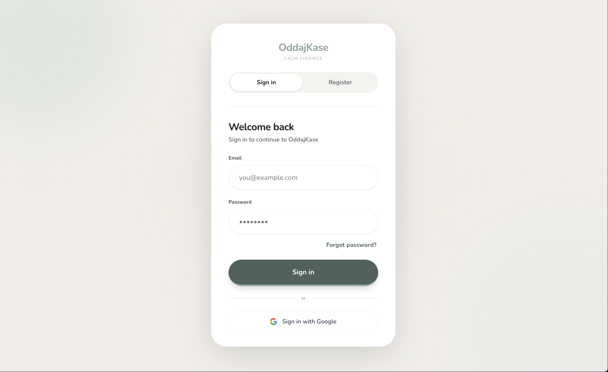

You can sign in with an existing account, register a new one, or use **Sign in with Google**.

---

### Dashboard

After logging in, you land on the main dashboard.

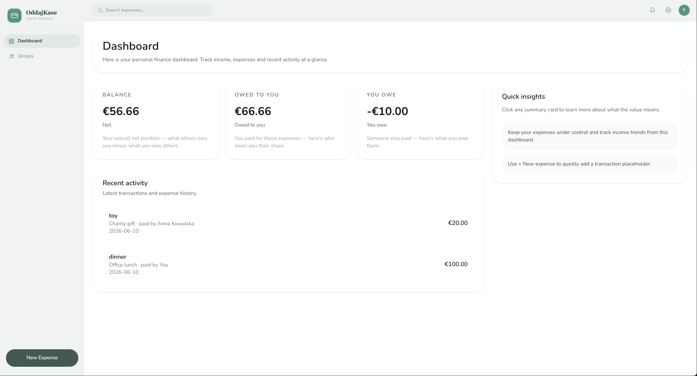

The dashboard shows:

- Your **overall balance**
- How much **others owe you**
- How much **you owe** others

Click any card to drill into the details.

#### Balance details

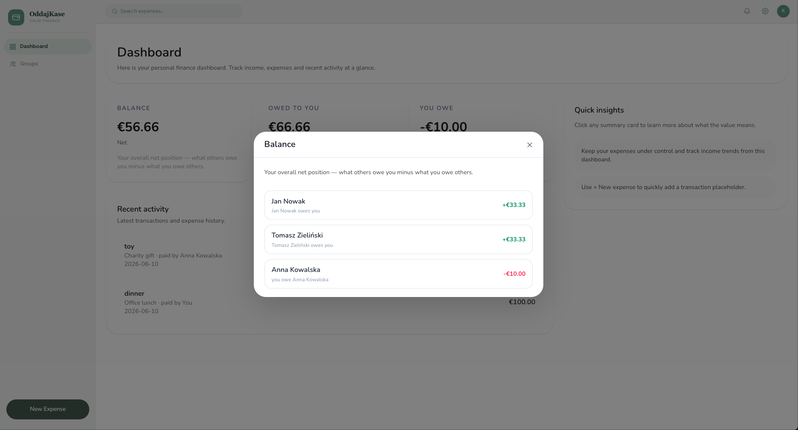

#### What you owe

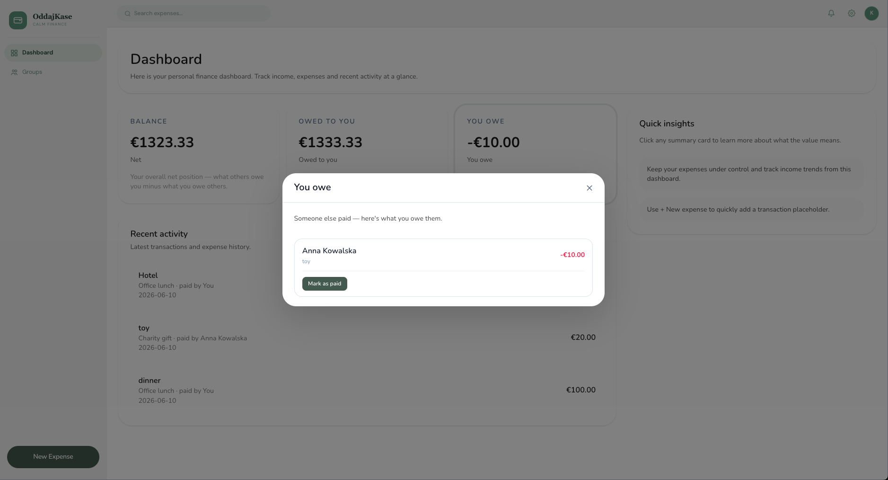

#### What others owe you

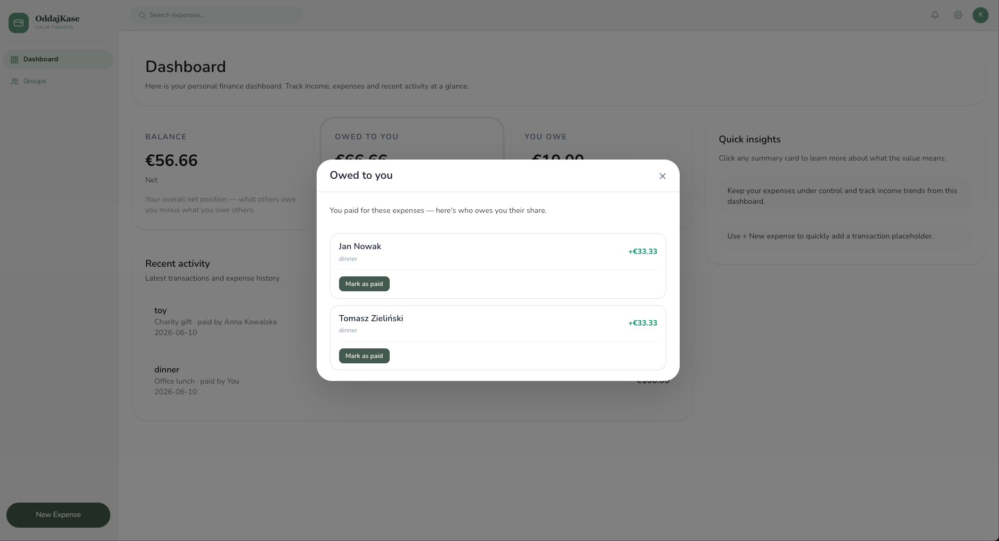

---

### Groups

Click **Groups** in the sidebar to manage your expense groups.

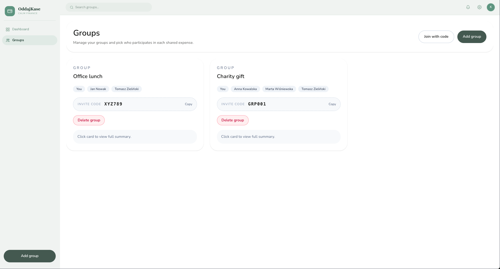

From the Groups page you can:

- **Join a group** by entering a group code

  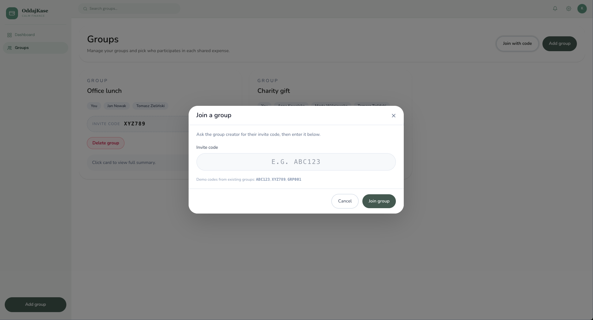

- **Create a new group**

  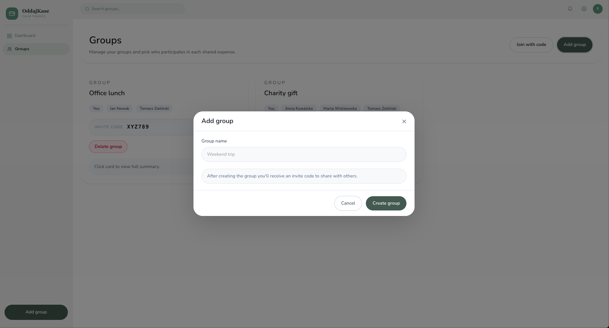

- **View group details** by clicking on any group card

  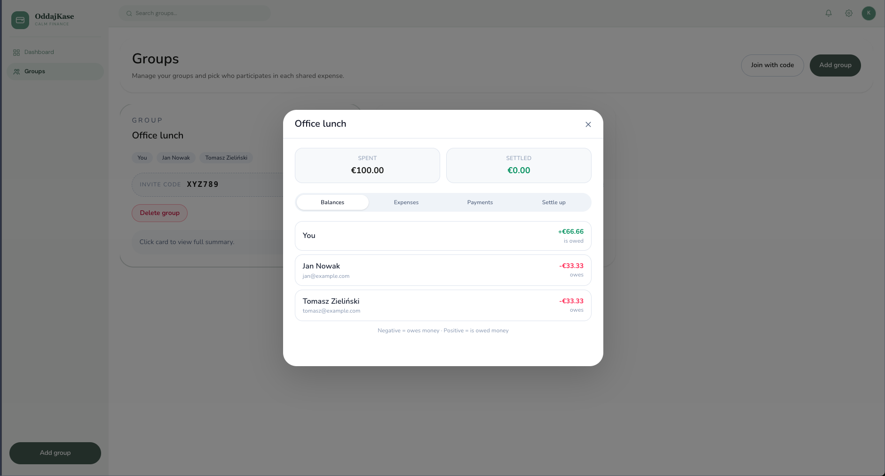

#### Inside a group

Each group has four tabs:

**Balance** — see who owes what within the group  
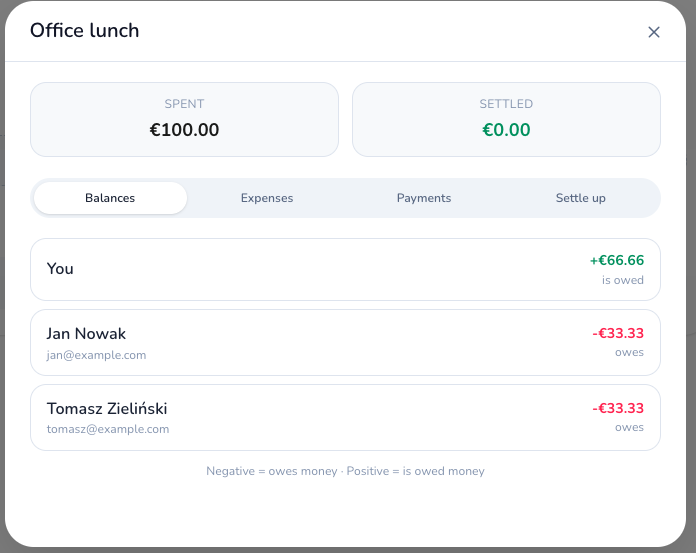

**Expenses** — all expenses recorded for the group  
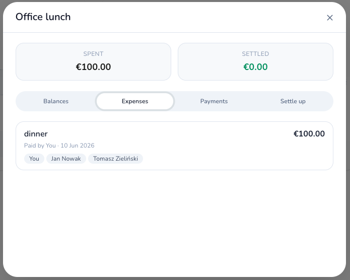

**Payments** — payment history  
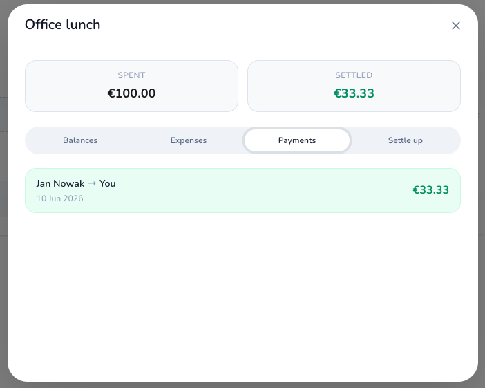

**Settle up** — suggested settlements to clear balances  
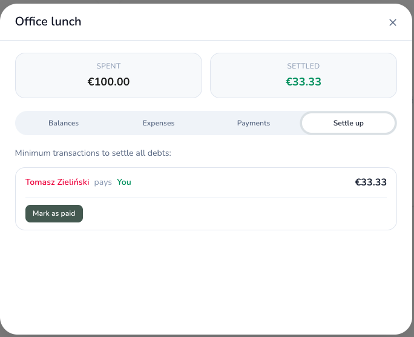

---

### Marking Payments as Settled

You can mark payments as settled from two places:

- **Dashboard** — click the "Owed to you" or "You owe" card
- **Group details** — go to the **Settle up** tab inside any group

To mark a debt as paid from the Dashboard, click the **"Owed to you"** card. Click **Mark as paid**, then confirm.

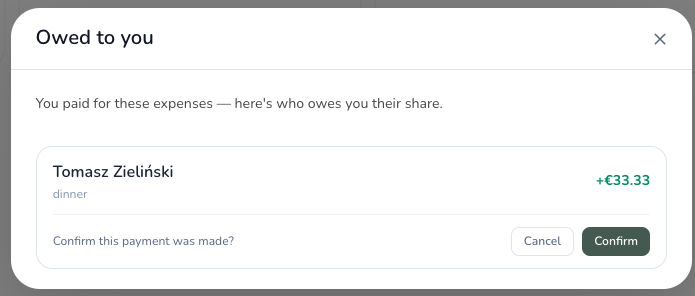

The balance updates immediately and the card reflects the new state.

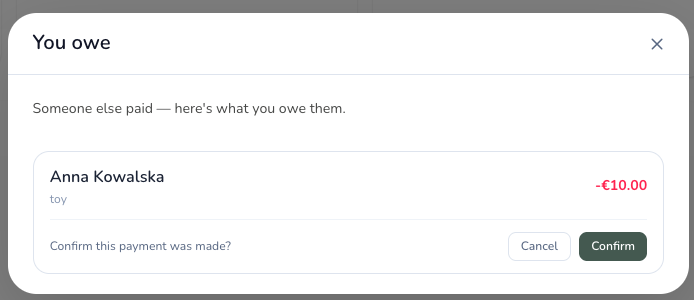

The same flow works in reverse for the **"You owe"** card.

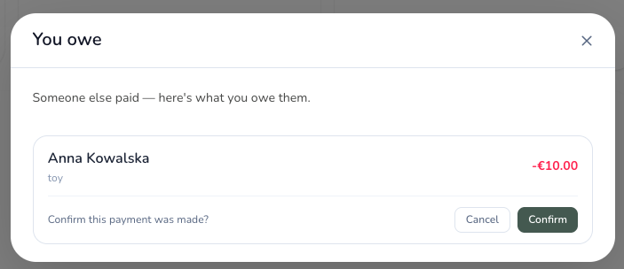

---

### Adding an Expense

Click **New Expense** in the sidebar to open the expense form.

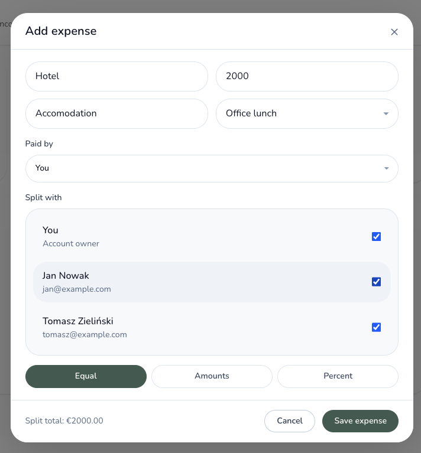

Fill in:

- **Name** — what the expense was for
- **Amount** — total cost
- **Category** — type of expense
- **Group** — which group to assign it to
- **Paid by** — who paid upfront

Then choose how to split:

**Equal split** — divided evenly among participants  
**By amount** — specify exact amounts per person  
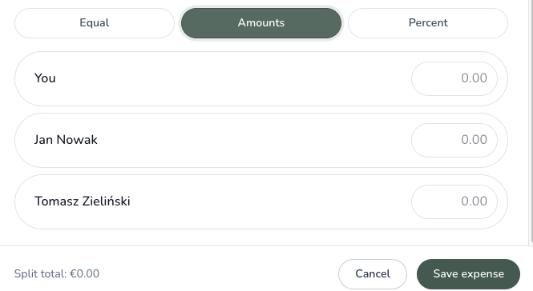

**By percentage** — specify each person's share as a percentage  
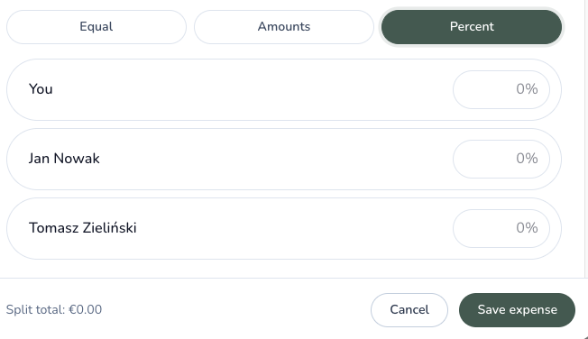

Click **Save expense** to confirm.

The expense then appears on the dashboard...

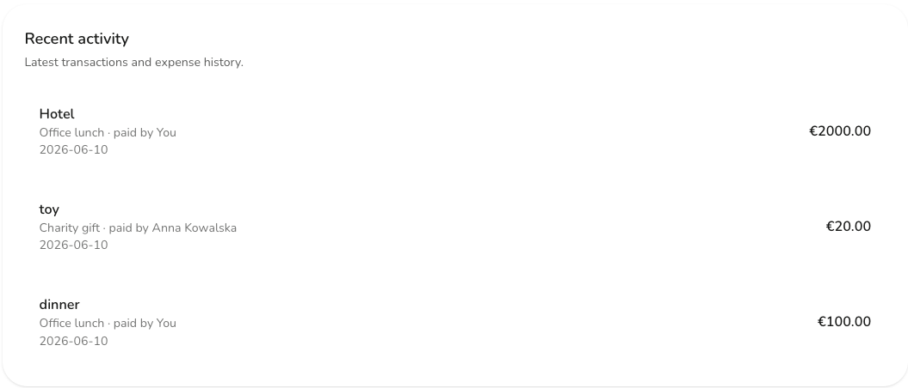

...and in the group's expense list.

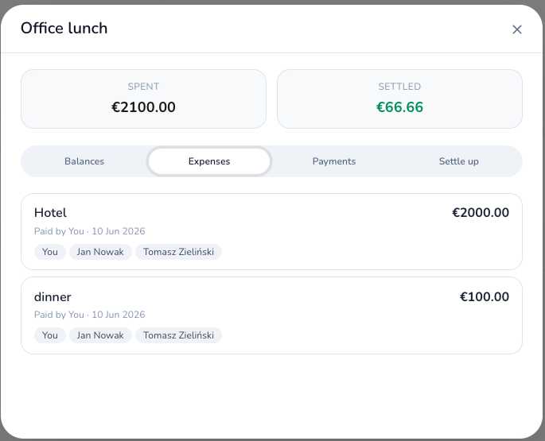
