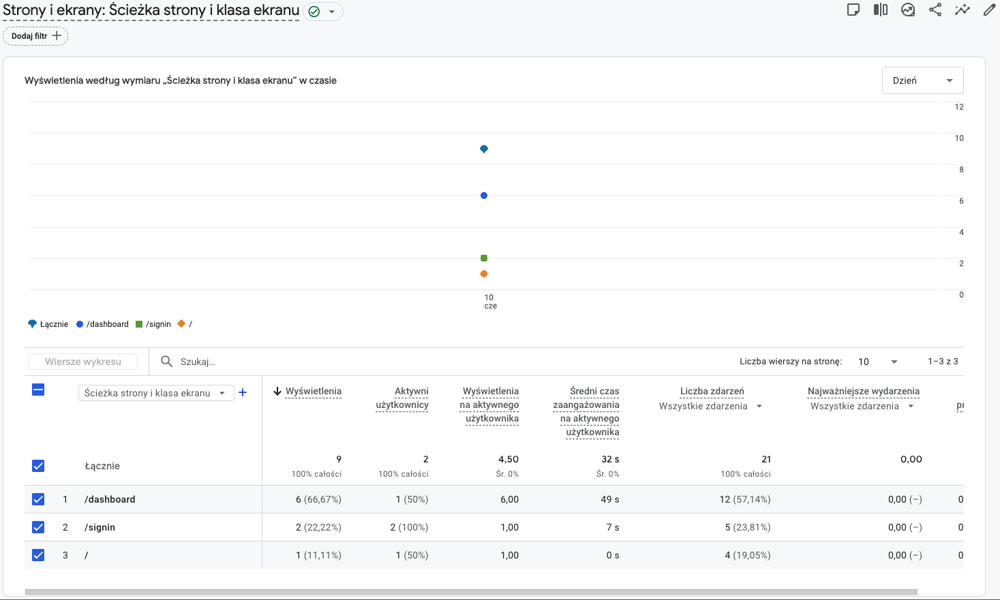
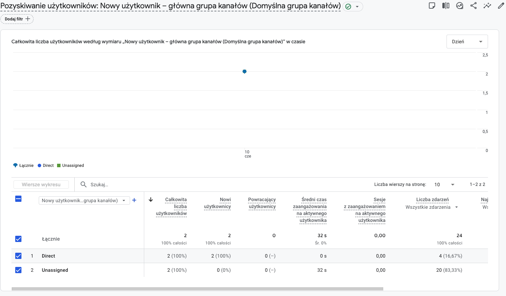
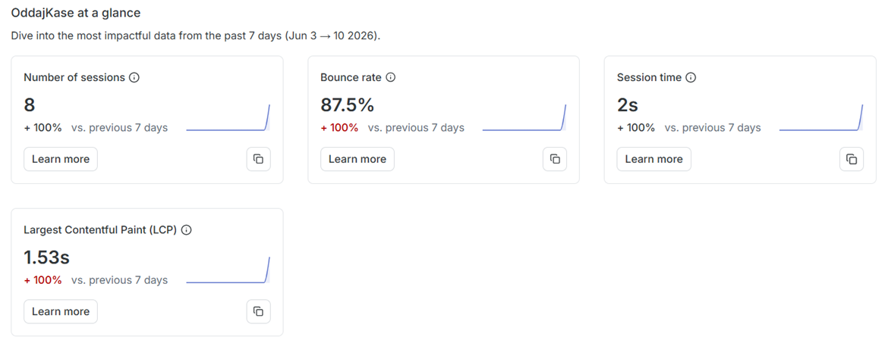
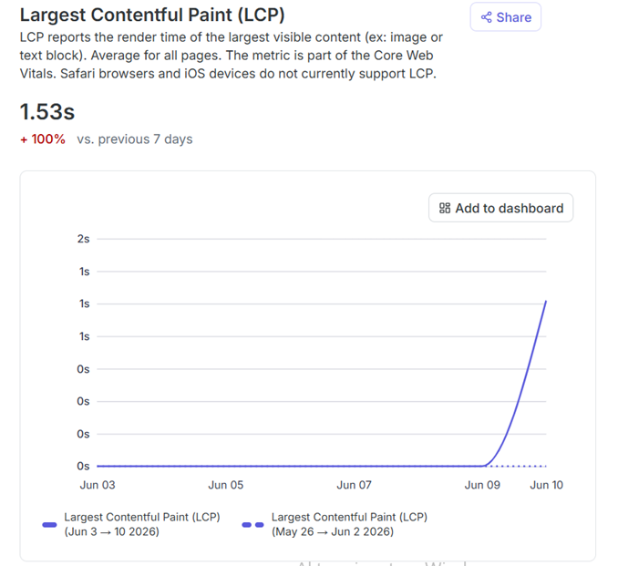
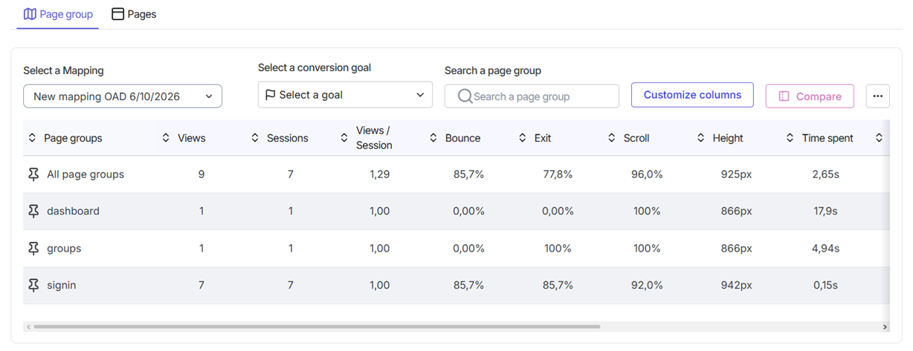
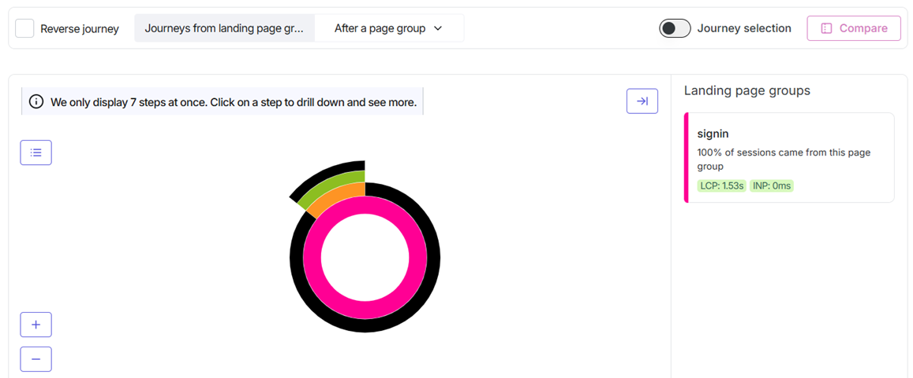

# OddajKase 💸

> A React-based expense sharing dashboard — track who owes what, split costs, and settle up easily.

🌐 **Live app:** [oddaj-kase.vercel.app](https://oddaj-kase.vercel.app/)  
🎨 **Figma design:** [Expense Dashboard with Modal](https://www.figma.com/design/bR6ebiYDg9SBekyvRQFkID/Expense-Dashboard-with-Modal)

**Differences report:** [differences](https://docs.google.com/document/d/1VwrIWJKlFGBIJZhdRPAVcmwTYmb8Zd_Yt2GhG4sXtHE/edit?tab=t.0)

---

## Tech Stack

- **React** (Vite) — component-based UI with fast HMR
- **Firebase** — authentication (email/password + Google OAuth) and data storage
- **Google Analytics** — usage tracking
- **Hotjar** — session recordings and heatmaps to visualize user behaviour
- Deployed on **Vercel**

---

## Getting Started

### 1. Install dependencies

```bash
npm i
```

### 2. Set up environment variables

Copy the example env file and fill in your Firebase project credentials:

```bash
cp .example.env .env
```

Required variables in `.env`:

| Variable                            | Description                  |
| ----------------------------------- | ---------------------------- |
| `VITE_FIREBASE_API_KEY`             | Firebase API key             |
| `VITE_FIREBASE_AUTH_DOMAIN`         | Firebase auth domain         |
| `VITE_FIREBASE_PROJECT_ID`          | Firebase project ID          |
| `VITE_FIREBASE_STORAGE_BUCKET`      | Firebase storage bucket      |
| `VITE_FIREBASE_MESSAGING_SENDER_ID` | Firebase messaging sender ID |
| `VITE_FIREBASE_APP_ID`              | Firebase app ID              |

### 3. Start the development server

```bash
npm run dev
```

---

## Features & Usage Guide

### Login

Unauthenticated users are redirected to the login page.


You can sign in with an existing account, register a new one, or use **Sign in with Google**.

---

### Dashboard

After logging in, you land on the main dashboard.


The dashboard shows:

- Your **overall balance**
- How much **others owe you**
- How much **you owe** others

Click any card to drill into the details.

#### Balance details


#### What you owe


#### What others owe you


---

### Groups

Click **Groups** in the sidebar to manage your expense groups.


From the Groups page you can:

- **Join a group** by entering a group code

  

- **Create a new group**

  

- **View group details** by clicking on any group card

  

#### Inside a group

Each group has four tabs:

**Balance** — see who owes what within the group  


**Expenses** — all expenses recorded for the group  


**Payments** — payment history  


**Settle up** — suggested settlements to clear balances  


---

### Marking Payments as Settled

You can mark payments as settled from two places:

- **Dashboard** — click the "Owed to you" or "You owe" card
- **Group details** — go to the **Settle up** tab inside any group

To mark a debt as paid from the Dashboard, click the **"Owed to you"** card. Click **Mark as paid**, then confirm.


The balance updates immediately and the card reflects the new state.

The same flow works in reverse for the **"You owe"** card.


---

### Adding an Expense

Click **New Expense** in the sidebar to open the expense form.


Fill in:

- **Name** — what the expense was for
- **Amount** — total cost
- **Category** — type of expense
- **Group** — which group to assign it to
- **Paid by** — who paid upfront

Then choose how to split:

**Equal split** — divided evenly among participants  
**By amount** — specify exact amounts per person  


**By percentage** — specify each person's share as a percentage  


Click **Save expense** to confirm.

The expense then appears on the dashboard...


...and in the group's expense list.


---

## Google Analytics

The app uses Google Analytics 4 (GA4) to track usage. The tracking script is added directly in `index.html` inside `<head>`:

```html
<!-- Google tag (gtag.js) -->
<script
  async
  src="https://www.googletagmanager.com/gtag/js?id=G-87D2MGMDTC"
></script>
<script>
  window.dataLayer = window.dataLayer || [];
  function gtag() {
    dataLayer.push(arguments);
  }
  gtag("js", new Date());

  gtag("config", "G-87D2MGMDTC");
</script>
```

Replace `G-87D2MGMDTC` with your own Measurement ID from the GA4 property settings.

### Verifying it works — Realtime report

Go to **Reports → Realtime** in Google Analytics. Open the deployed app in another tab (with adblockres disabled) and you should see yourself appear as an active user within ~30 seconds.


### What users do — Engagement

Go to **Reports → Engagement → Pages and screens** to see which pages are visited most and how long users stay.



### Where users come from — Acquisition

Go to **Reports → Acquisition → Traffic acquisition** to see how users are finding the app (direct, Google search, referral, etc.).




## Contentsquare (Hotjar) Integration

The application is integrated with Contentsquare (Hotjar) to collect user behavior data and support UX analysis.

### Integration Details

The Contentsquare script was integrated by adding the following snippet to the `<head>` section of `index.html`:

```html
<script src="https://t.contentsquare.net/uxa/e0ff600412673.js"></script>
```
Additionally, a dedicated initialization function (`initContentsquare.ts`) was implemented to dynamically load the script when the application starts. The function verifies that the code is executed in a browser environment and prevents duplicate script injection by checking whether the script has already been added to the document.

```ts 
export function initContentsquare(): void {
    if (typeof window === 'undefined') return;
    const src = 'https://t.contentsquare.net/uxa/e0ff600412673.js';
    if (document.querySelector(`script[src="${src}"]`)) return;
    const s = document.createElement('script');
    s.src = src;
    s.async = true;
    document.head.appendChild(s);
}
```
This approach ensures that Contentsquare is loaded only once and does not negatively impact application performance.

### Features

- Session recording
- User interaction tracking
- Navigation path analysis
- Heatmap generation
- User behavior monitoring across the application

### Purpose

The integration helps identify usability issues, understand how users interact with the application, and make data-driven decisions regarding future improvements and feature development.

### Collected Data & Insights

After successfully deploying the integration, user activity and performance metrics were analyzed during the test period (June 3 – June 10, 2026). The following dashboards illustrate the key findings:

#### 1. Application Performance & Overview (Core Web Vitals)
The integration provides an at-a-glance overview of the core metrics. A crucial element of this monitoring is tracking the **Largest Contentful Paint (LCP)**, which measures perceived loading speed and marks the point in the page load timeline when the page's main content has likely loaded.





#### 2. Traffic Distribution & User Journeys
By defining custom **Page Groups**, the application maps exact traffic numbers and behavior across different routing sections (`signin`, `dashboard`, `groups`).



The behavior flow analysis (User Journeys) confirms the entry paths and subsequent navigation habits. In the analyzed sample, the entry point was heavily centered around the authorization view.



### Key Analytical Findings

Based on the collected data from the initial traffic spike, several behavioral patterns were identified to drive future optimization:
- **End-to-End User Journey Verification:** The telemetry confirms the successful execution of a complete, critical user path within the application. The flow initiated at the login screen (`/signin`), progressed through group creation/management (`/groups`), and concluded at the main dashboard (`/dashboard`) where users added expenses and verified their final balance.
- **High Friction on Sign-In:** The `/signin` route recorded the highest volume of views (7 views) and sessions (7 sessions), but exhibited a high **Bounce Rate (85.7%)** and an extremely low average **Time spent (0.15s)**. This indicates that users either encountered immediate friction or that automated test interactions quickly hit this boundary before bouncing.
- **High Engagement in Dashboard:** In contrast, users who successfully passed the authorization layer spent an average of **17.9 seconds** on the `/dashboard` route with a **0.00% Bounce Rate**, proving high engagement once inside the application core.
- **Desktop Domination:** All recorded traffic within this diagnostic window was initiated exclusively via **Desktop devices**, which provides a clear focus area for the immediate layout stability tuning.
